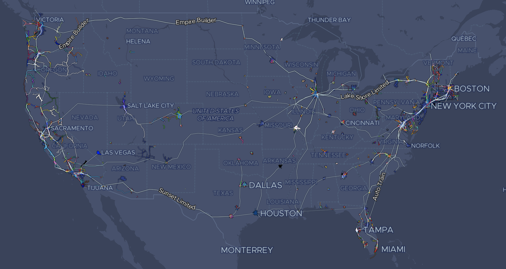

# All transit

[](https://travis-ci.org/kylebarron/all-transit)

[](https://kylebarron.dev/all-transit)

[Website: https://kylebarron.dev/all-transit](https://kylebarron.dev/all-transit)

All transit in the continental US, as reported by the [Transitland
database](https://transit.land) Inspired by [_All
Streets_](https://benfry.com/allstreets/map5.html).

```bash
git clone https://github.com/kylebarron/all-transit
cd all-transit
pip install transitland-wrapper
mkdir -p data

# All operators
transitland operators --geometry data/gis/states/states.shp > data/operators.geojson

# All operator `onestop_id`s
cat data/operators.geojson | jq '.properties.onestop_id' | uniq |  tr -d \" > data/operator_onestop_ids.txt

# All routes
transitland routes --geometry data/gis/states/states.shp > data/routes.geojson

# Split these routes into different files by operator
# NOTE: It's probably simpler to just loop over operators when calling the API
# originally, rather than using jq to split a single file, but I didn't do that
# the first time and I didn't want to burden the API server more.
mkdir -p data/routes/
cat data/operator_onestop_ids.txt | while read operator_id
do
    cat data/routes.geojson \
        | jq -c "if .properties.operated_by_onestop_id == \"$operator_id\" then . else empty end" \
        > data/routes/$operator_id.geojson
done

# All route stop patterns `onestop_id`s for those routes:
cat data/routes.geojson | jq '.properties.route_stop_patterns_by_onestop_id[]' | uniq | tr -d \" > data/route_stop_patterns_by_onestop_id.txt

# All stops
rm data/stops.geojson
cat data/operator_onestop_ids.txt | while read operator_id
do
    transitland stops \
        --served-by $operator_id --per-page 1000 >> data/stops.geojson
done

# Split these stops into different files by operator
# NOTE: Again, if I were doing this again, I'd just write into individual files
# in the above step, but I didn't want to spend more time calling the API
# server.
mkdir -p data/stops/
cat data/operator_onestop_ids.txt | while read operator_id
do
    cat data/stops.geojson \
        | jq -c "if .properties.operators_serving_stop | any(.operator_onestop_id == \"$operator_id\") then . else empty end" \
        > data/stops/$operator_id.geojson
done

# All route-stop-patterns (completed relatively quickly, overnight)
transitland onestop-id --file data/route_stop_patterns_by_onestop_id.txt > data/route-stop-patterns.json

# All schedule-stop-pairs
mkdir -p data/ssp/
cat data/operator_onestop_ids.txt | while read operator_id
do
    transitland schedule-stop-pairs \
        --operator-onestop-id $operator_id --per-page 1000 --active | gzip > data/ssp/$operator_id.json.gz
done
```

### Put into vector tiles

```bash
# Writes mbtiles to data/routes.mbtiles
# The -c is important so that each feature gets output onto a single line
cat data/routes.geojson | jq -c -f code/jq/routes.jq | bash code/tippecanoe/routes.sh

# Writes mbtiles to data/operators.mbtiles
bash code/tippecanoe/operators.sh data/operators.geojson

# Writes mbtiles to data/stops.mbtiles
# The -c is important so that each feature gets output onto a single line
cat data/stops.geojson | jq -c -f code/jq/stops.jq | bash code/tippecanoe/stops.sh
```

Combine into single mbtiles
```bash
tile-join \
    -o data/all.mbtiles \
    --no-tile-size-limit \
    --force \
    stops.mbtiles operators.mbtiles routes.mbtiles
```

## Schedules

```bash

# Loop over operators
mkdir -p data/ssp_geom
cat data/operator_onestop_ids.txt | while read operator_id
    bash code/schedules/main.sh $operator_id
done
```

Then cut these into tiles:
```bash
mkdir -p data/ssp_geom_tiles
for file in data/ssp_geom/*.geojson; do
    python code/tile_geojson.py -z 12 -Z 12 --allowed-geom-type 'LineString' -d data/ssp_geom_tiles $file
done
```

Then compress these tiles
```bash
mkdir -p data/ssp_geom_tiles_comp
for file in data/ssp_geom_tiles/**/*.geojson; do
    z="$(echo $file | awk -F'/' '{print $(NF-2)}')"
    x="$(echo $file | awk -F'/' '{print $(NF-1)}')"
    y="$(basename $file .geojson)"
    mkdir -p data/ssp_geom_tiles_comp/$z/$x
    # Take only the coordinates, minified, and gzip them
    cat $file | jq -c '.geometry.coordinates' | gzip > data/ssp_geom_tiles_comp/$z/$x/$y.json.gz
done
```
