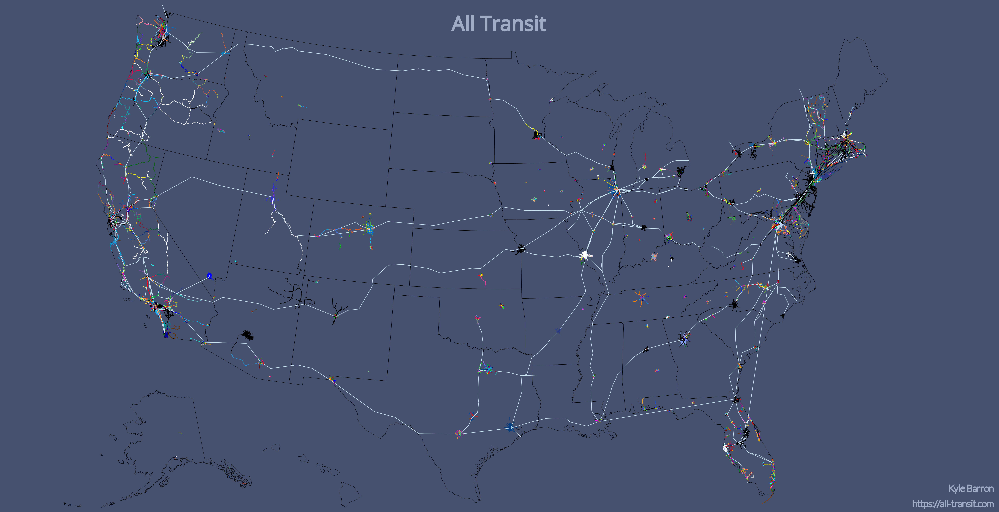

# Static SVG/PNG



## Overview

The image generation follows the general outline of
[code](https://bl.ocks.org/mbostock/fb6c1e5ff700f9713a9dc2f0fd392c35) by Mike
Bostock.

### `geo2svg`

`geo2svg` is a command line application exposed through
[`d3-geo-projection`](https://github.com/d3/d3-geo-projection/blob/master/README.md#geo2svg).
You can feed it a GeoJSON and it turns it into an SVG.

To use, just run
```bash
geo2svg -n -w ${WIDTH} -h ${HEIGHT}
```
where you use `-n` if the input is newline-delimited, and `-w` and `-h` are the
width and height of the SVG.

**However, it isn't quite that simple**. If you run it alone on a GeoJSON file,
you'll likely get non-sensical output because `geo2svg` doesn't reproject your
data for you. Instead, you need to choose a projection, reproject your data to
that CRS, and then pass the data to `geo2svg`. See `geoproject` below.

In order to define specific colors for lines in the output svg, you need to
assign _`stroke`_ fields in your GeoJSON features. I use `jq` to do that:

```bash
cat data.geojson | jq -c 'if (.properties.color == "") or (.properties.color == "000000") or (.properties.color == "ffffff") then .properties.stroke = "hsl(229, 50%, 35%)" else .properties.stroke = ("#" + .properties.color) end | .properties += {"stroke-width": 0.4}'
```

This sets `stroke` based on `.properties.color` in each feature. Some routes
don't have a color. For any feature whose `color` is missing, pure white, or
pure black, I substitue a fallback color: `hsl(229, 50%, 35%)`, which is also
what I use for the fallback color in the website.

I also set `.properties.stroke-width` to be `0.4`, which sets the SVG stroke
width for every route to `0.4`.

### `geoproject`

`geoproject` is also exposed through
[`d3-geo-projection`](https://github.com/d3/d3-geo-projection/blob/master/README.md#geoproject).
It reprojects your input GeoJSON data to a projected coordinate system of your
choosing.

A list of default projections that `d3-geo-projection` supports is
[here](https://github.com/d3/d3-geo-projection/blob/master/README.md#projections).
[`d3.geoAlbersUsa()`](https://github.com/d3/d3-geo/blob/v1.11.9/README.md#geoAlbersUsa)
is a good default for data whose extent is the U.S.

```bash
cat data.geojson | geoproject -n "d3.geoAlbersUsa()" > projected.geojson
```
Remove the `-n` if your data isn't newline-delimited.

Mike Bostock's
[example](https://bl.ocks.org/mbostock/fb6c1e5ff700f9713a9dc2f0fd392c35#prepublish)
also uses [`.fitExtent`](https://github.com/d3/d3-geo#projection_fitExtent), so
that the output SVG is centered in its viewbox. I had problems with that
approach. That appeared to center _every_ input feature. It also centered each
route across the viewbox. So a transit route going across Boston was rescaled to
go across the entire viewbox, and thus a mess of spaghetti was created.

Because of my issues with that, I don't use `.fitExtent`, and just modified the
height and width of the SVG so that the output was generally centered.

### Custom title

I also splice a custom title and attribution text into the output SVG, using the
source at [`title.svg`](title.svg). I use Open Sans for the title font, and
center it at the top. I use Lato for the attribution because I had issues making
Open Sans legible at small font sizes.

I use the Google Fonts API to load each web font. This loads each web font in
the specified sizes from the Google Fonts API:

```xml
<defs>
  <style type="text/css">@import url('https://fonts.googleapis.com/css?family=Open+Sans:300,400|Lato:100');</style>
</defs>
```

I can later specify the font to use by passing `font-family="Lato"` in the
`text` or `g` tags.

## Image generation

`make_us.sh` is a Bash script to generate the above image.

### Data

The script expects certain files:

- `states.shp`: This is included in the Git repository at `../data/gis/states/states.shp`, and shouldn't be an issue.
- `operator_ids.txt`: A text file with operators to include. By default the bash script expects it to live at `../data/operator_onestop_ids.txt`. The [main README](../README.md) contains directions for generating this file.
- `routes/*.geojson`: A directory of newline-delimited GeoJSON files that portray transit routes in the U.S. `make_us.sh` expects these files to live at `../data/routes/$operator_id.geojson`, where `$operator_id` is each operator listed in `operator_ids.txt` mentioned above.

### Dependencies

Dependencies include

- `d3-geo-projection`: for projecting GeoJSON geometries from latitude/longitude (EPSG 4326) to a projected coordinate system. For the U.S. I use [`d3.geoAlbersUsa()`](https://github.com/d3/d3-geo/blob/v1.11.9/README.md#geoAlbersUsa). This also includes `geo2svg`, which converts a GeoJSON to svg.
- `shapefile`: for converting the `states.shp` shapefile to GeoJSON
- `svgo`: for simplifying the exported svg.
- `svgexport`: for converting the simplified svg (still >50MB) to png.

You can install all these dependencies with
```
yarn install
```
or
```
npm install
```
and the necessary binaries will be located at `./node_modules/.bin`.

### Run

```bash
bash ./make_us.sh
```
